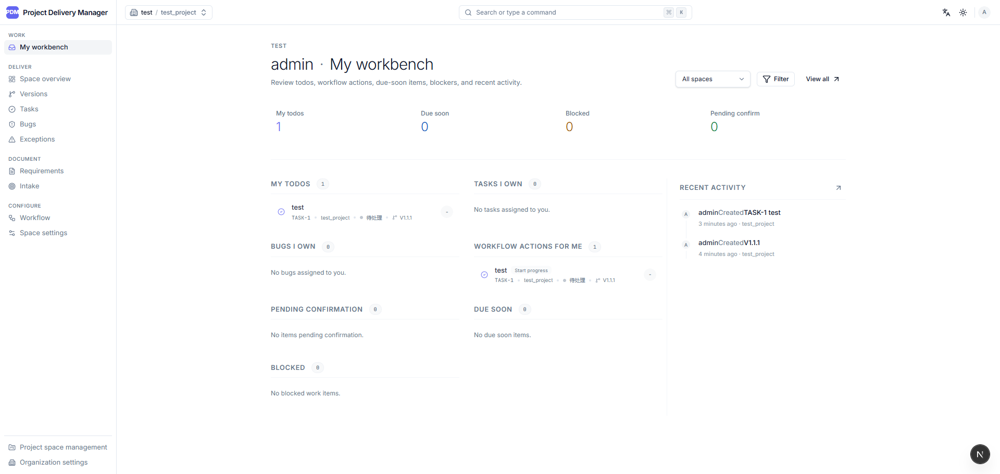
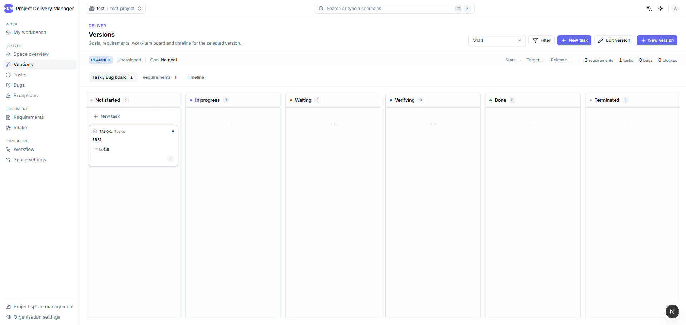
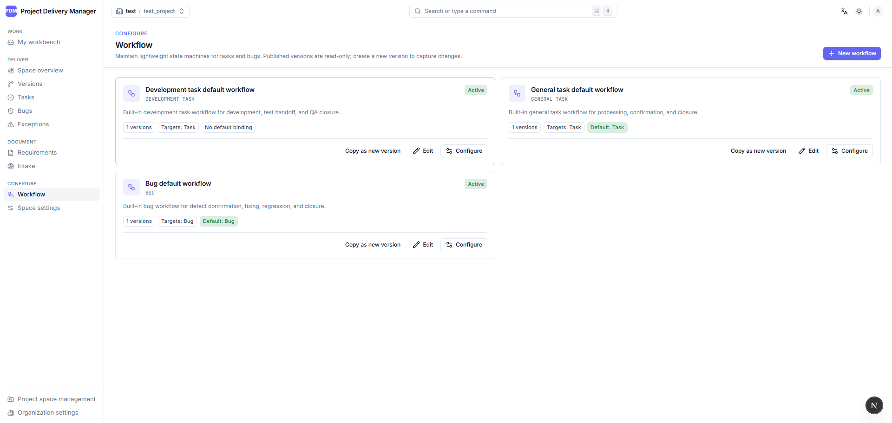
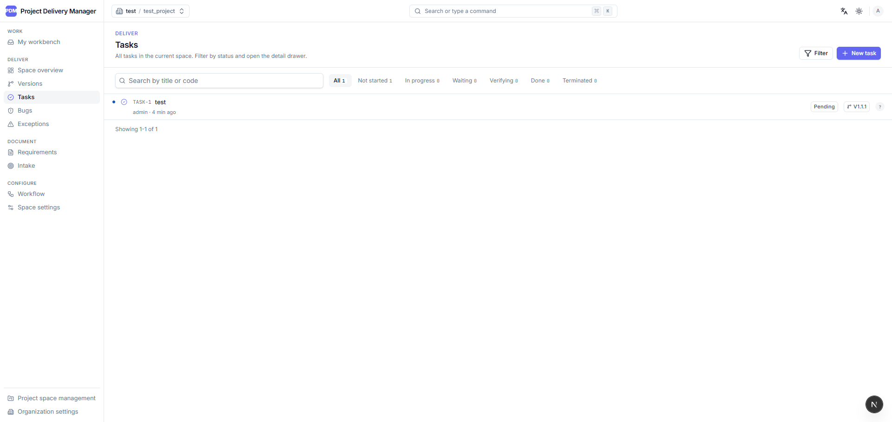
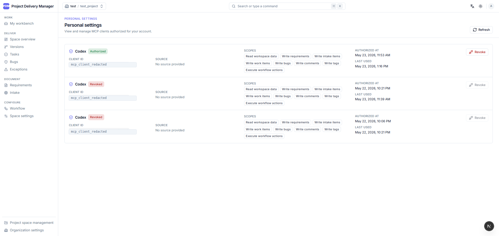
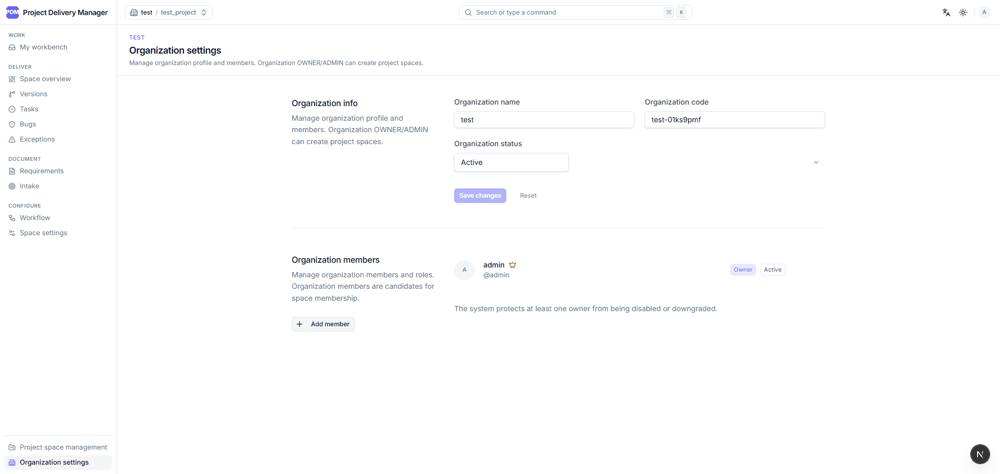
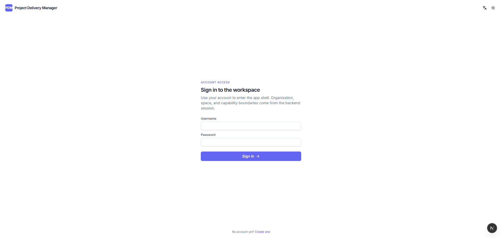

# Project Delivery Manager

English | [简体中文](README.zh-CN.md)

Project Delivery Manager, or PDM, is a SaaS-ready product delivery management
platform for small software teams. It brings requirements, intake, tasks, bugs,
custom workflows, version boards, realtime refresh, and MCP-based AI agent access
into one TypeScript monorepo.

Keywords: product delivery management, project management, requirements
management, issue tracking, bug tracking, workflow management, SaaS, MCP, OAuth,
Next.js, NestJS, Prisma, PostgreSQL.

## What It Solves

Small product teams often keep requirements, decisions, development tasks, test
feedback, bug fixes, release scope, and delivery risks in separate tools or chat
threads. PDM is designed to keep those objects connected and traceable without
turning the workflow into a heavy enterprise process platform.

The core workflow is:

```text
Register/login -> Organization -> Project space -> Version
  -> Requirement / Intake item -> Task / Bug
  -> Workflow action -> Timeline -> Workbench / Board / Exception view
```

## Features

- SaaS-ready organization and project-space isolation.
- Username/password authentication with database sessions and HttpOnly cookies.
- Organization members, project-space members, and role-based permissions.
- Version management for delivery scope and progress tracking.
- Requirement documents with Tiptap rich text, Markdown support, image uploads,
  comments, attachments, and timeline history.
- Intake pool for collecting work sources and splitting accepted items into one
  or more tasks.
- Unified work item model for `TASK` and `BUG`, with separate user-facing pages.
- Configurable lightweight workflow engine with states, actions, permissions,
  action forms, and workflow versions.
- My workbench, project overview, version board, and exception views.
- Exception tracking for overdue, blocked, pending confirmation, pending
  regression, and stale work items.
- Tags for requirements, intake items, tasks, and bugs.
- Human-readable object codes such as `REQ-12`, `INTAKE-8`, `TASK-42`, and
  `BUG-17`.
- Realtime local refresh through SSE invalidation events.
- Chinese and English UI with light, dark, and system themes.
- MCP server integration for AI agents, protected by OAuth 2.1 + PKCE and scoped
  Bearer tokens.

## Screenshots

| My workbench | Version board |
| --- | --- |
|  |  |

| Workflow configuration | Task list |
| --- | --- |
|  |  |

| MCP client authorizations | Organization settings |
| --- | --- |
|  |  |

| Account access |
| --- |
|  |

## MCP And AI Agent Access

PDM exposes selected product delivery capabilities through Model Context
Protocol tools. The first-phase MCP surface includes context lookup, object code
lookup, workbench, space overview, version board, exceptions, requirements,
intake items, tasks, bugs, comments, tags, and timelines.

Current tool names use the `pdm.*` namespace, for example:

- `pdm.context.get`
- `pdm.object.lookup_code`
- `pdm.requirement.create`
- `pdm.work_item.execute_action`
- `pdm.bug.create`
- `pdm.tag.replace_assignments`

MCP requests do not reuse the web session cookie. They require OAuth access
tokens scoped for the MCP resource, and business permissions are still enforced
by the existing organization, project-space, object, role, and workflow rules.

## Tech Stack

| Area | Technology |
| --- | --- |
| Monorepo | pnpm workspaces |
| Web | Next.js, React, TypeScript |
| API | NestJS, TypeScript |
| Database | PostgreSQL, Prisma |
| Shared contracts | Zod schemas in `packages/shared` |
| UI | Tailwind CSS, Radix UI primitives, lucide-react |
| Editor | Tiptap plus Markdown mode |
| File storage | MinIO behind the API |
| Realtime | Server-Sent Events |
| E2E | Playwright |
| Unit tests | Vitest |

## Repository Layout

```text
apps/
  api/        NestJS API application
  web/        Next.js web application
packages/
  shared/     Zod schemas, DTOs, enums, errors, OpenAPI helpers
prisma/       Prisma schema and migrations
tests/e2e/    Playwright API and UI E2E tests
deploy/       nginx production entrypoint config
docs/         README screenshot assets
```

## Requirements

- Node.js 22 or newer.
- Corepack with pnpm 11.1.1.
- PostgreSQL for the API database.
- MinIO or another S3-compatible service for attachment flows.

For full local E2E, see [tests/e2e/README.md](tests/e2e/README.md).

## Local Development

Enable the pinned package manager:

```bash
corepack enable
corepack prepare pnpm@11.1.1 --activate
```

Install dependencies:

```bash
corepack pnpm install
```

Prepare environment files:

```bash
cp .env.example .env
```

Generate Prisma client and run migrations as needed:

```bash
corepack pnpm --filter @project-delivery/api prisma:generate
corepack pnpm --filter @project-delivery/api prisma:migrate
```

Start both applications:

```bash
corepack pnpm dev
```

Or run them separately:

```bash
corepack pnpm dev:api
corepack pnpm dev:web
```

## Verification

Run the standard local gate:

```bash
corepack pnpm verify
```

`verify` runs lint, typecheck, unit tests, and build.

Run the local E2E gate:

```bash
corepack pnpm verify:e2e:local
```

Run Docker-backed E2E:

```bash
corepack pnpm test:e2e:full
```

Useful targeted commands:

```bash
corepack pnpm lint
corepack pnpm typecheck
corepack pnpm test
corepack pnpm build
corepack pnpm test:e2e:list
```

## Deployment

The repository includes a single-machine HTTP deployment path based on Docker
Compose:

- [docker-compose.prod.yml](docker-compose.prod.yml)
- [docker-compose.prod.registry.yml](docker-compose.prod.registry.yml)
- [Dockerfile.api](Dockerfile.api)
- [Dockerfile.web](Dockerfile.web)
- [deploy/nginx.conf](deploy/nginx.conf)
- [.env.prod.example](.env.prod.example)

For HTTP deployment, `SESSION_COOKIE_SECURE=false` must match the actual origin.
When moving to HTTPS, switch it back to secure cookie behavior.
Public and private browser entry points are accepted when the request `Host`
matches the browser `Origin`. OAuth/MCP metadata is derived from the current
request `Host`, and attachment upload/download flows go through the API to the
internal MinIO service. Production only needs the Nginx port exposed.

## Current Status

The MVP product workflow, tags, human-readable object codes, realtime refresh,
and the main MCP implementation are present in the codebase. The remaining
release-sensitive checks are full API/UI E2E in a complete PostgreSQL + MinIO +
API + Web environment, plus OAuth/MCP Inspector or equivalent end-to-end
verification for the MCP surface.

## License

This project is licensed under the [MIT License](LICENSE).
